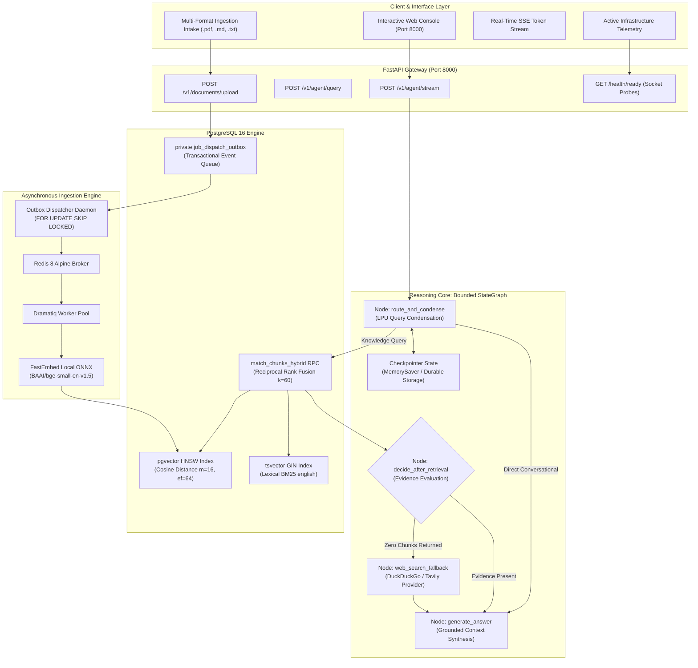
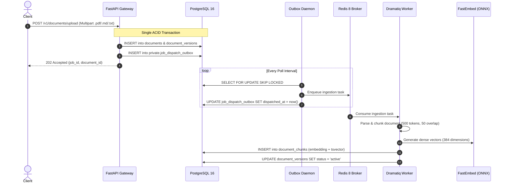
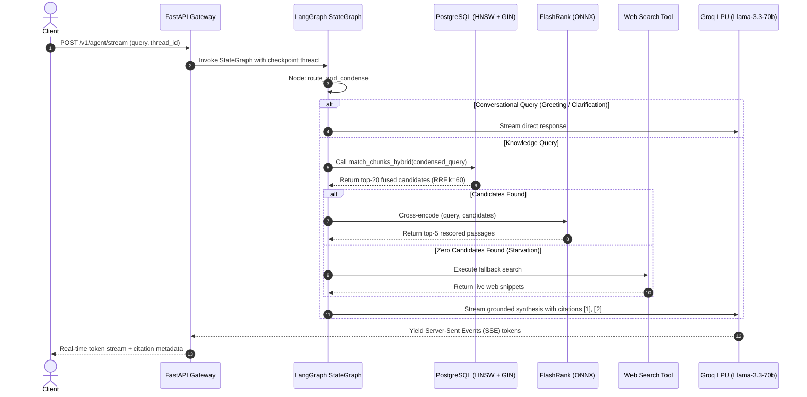

# Adaptive & Corrective Agentic RAG

A distributed retrieval-augmented generation engine implementing bounded state graphs, hybrid search (HNSW pgvector + BM25 tsvector), cross-encoder reranking, transactional outbox ingestion, and deterministic citation verification.

---

## 1. Architectural Thesis: Beyond Naive RAG

Most retrieval-augmented generation systems are constructed as linear scripts: an unindexed prompt template chained to a single vector database query and an unbounded language model call. 

While sufficient for static single-document demos, naive pipelines fail predictably under real-world workloads:
- **Conversational Pronoun Starvation**: When a user follows up with *"What did it cost?"*, a naive vector search queries the pronoun *"it"*, retrieving completely irrelevant chunks.
- **Semantic Distance Blind Spots**: High-dimensional vector cosine distance excels at semantic similarity but frequently fails on exact keyword identifiers (part numbers, legal clause codes, error hashes).
- **The "Lost-in-the-Middle" Position Decay**: Bi-encoder vector search returns chunks based on individual embedding distances. Stuffed into a large context window, language models focus disproportionately on the first and last tokens, ignoring critical evidence buried in the middle chunks.
- **Information Starvation**: If the local index contains zero relevant context, a naive pipeline forces the generator to answer anyway, triggering hallucinations.
- **Distributed Dual-Write Inconsistency**: Ingestion scripts that upload a file and immediately call a remote vector database risk partial failures—if the vector database network call drops, the database and vector store drift out of sync permanently.

This platform replaces ad-hoc chains with the canonical blueprints defined in modern retrieval research—combining **Adaptive RAG** (evaluating query complexity to route execution), **Corrective RAG / CRAG** (evaluating evidence sufficiency with automated fallback), **Dual-Engine Hybrid Search with Reciprocal Rank Fusion**, **Local ONNX Cross-Encoder Reranking**, and **ACID Transactional Outbox Ingestion**.

### Architectural Comparison: Naive Pipeline vs. Bounded Agentic RAG

| Architectural Dimension | Naive / Tutorial RAG | Bounded Agentic Architecture (This System) |
| :--- | :--- | :--- |
| **Control Flow** | Hardcoded linear pipe: `Query -> Embed -> Retrieve -> LLM`. Cannot branch, retry, or self-correct. | **Deterministic StateGraph**: Dynamically routes between direct answers, local hybrid retrieval, and web search fallback. |
| **Conversational Memory** | Stuffs raw chat history into vector search or prompt, corrupting embedding similarity. | **Query Condensation**: Sub-second LPU inference rewrites pronouns and multi-turn context into self-contained search queries. |
| **Retrieval Engine** | Single dense vector index (approximate nearest neighbor only). | **Dual-Engine Hybrid**: Dense cosine HNSW + BM25 `tsvector` GIN fused via PostgreSQL Reciprocal Rank Fusion ($k=60$). |
| **Candidate Rescoring** | None. LLM receives top-$k$ purely ordered by bi-encoder cosine distance. | **Local ONNX Cross-Encoder**: Joint self-attention over query-passage pairs eliminates position bias and filters noise. |
| **Zero-Evidence Handling** | LLM hallucinates or produces ungrounded guesses when retrieval is empty. | **Autonomous Fallback**: Corrective router detects zero-chunk states and routes to external web search tools. |
| **Ingestion Consistency** | Dual-write hazard: file store and vector store updated in separate, uncoordinated network calls. | **Transactional Outbox**: Document metadata, staging, and outbox events committed in a single ACID PostgreSQL transaction. |
| **Queue Concurrency** | Unmanaged background threads or memory queues prone to data loss on worker crash. | **`FOR UPDATE SKIP LOCKED` Polling**: Transactional dispatcher feeds Redis 8 and Dramatiq with distributed ack/retry semantics. |
| **Citation Verification** | Generator is trusted to output accurate bracketed citations. | **AST Citation Audit**: Verbatim passage inspection validates bracketed references against retrieved chunk UUIDs. |

---

## 2. System Topology & Component Interactions



---

## 3. Core Architectural Pillars

### 3.1 Bounded StateGraph & Query Condensation (`AdaptiveRagGraph`)
The reasoning engine is structured as a bounded LangGraph `StateGraph`. Unlike autonomous loop agents that can diverge into unbounded recursion, this graph enforces a finite state machine:

```
[Start] ──> route_and_condense ──┬──[Conversational]──> generate_answer ──> [End]
                                 │
                                 └──[Search Required]──> retrieve_documents 
                                                                │
                                                                ▼
                                                     decide_after_retrieval
                                                                ├──[Evidence Found]────> generate_answer ──> [End]
                                                                │
                                                                └──[No Documents]──────> web_search_fallback 
                                                                                                │
                                                                                                ▼
                                                                                          generate_answer ──> [End]
```

- **Query Condensation**: Multi-turn conversations frequently introduce pronouns (*"What are its limits?"*, *"Can you elaborate on that point?"*). Before querying the database, the agent calls a high-speed LPU model (`llama-3.1-8b-instant`) to rewrite the conversation into an independent, disambiguated query string.
- **Corrective Fallback**: If candidate retrieval yields zero chunks—indicating an out-of-domain query or an empty workspace index—the agent automatically activates the `web_search_fallback` node to fetch external real-time context rather than returning an empty hallucination.

### 3.2 Dual-Engine Hybrid Retrieval & Reciprocal Rank Fusion
Vector similarity alone misses exact identifiers, while lexical full-text search misses conceptual paraphrases. The retrieval layer fuses both inside a PostgreSQL RPC function:

1. **Dense Vector Search**: Powered by `pgvector` with a Hierarchical Navigable Small World (HNSW) index using cosine distance:
   ```sql
   create index if not exists document_chunks_embedding_hnsw_idx
     on public.document_chunks using hnsw (embedding vector_cosine_ops)
     with (m = 16, ef_construction = 64);
   ```
2. **Lexical Full-Text Search**: Uses a stored generated `tsvector` column over chunk content with a Generalized Inverted Index (GIN):
   ```sql
   create index if not exists document_chunks_tsv_idx
     on public.document_chunks using gin(tsv_content);
   ```
3. **Reciprocal Rank Fusion (RRF)**: Dense and lexical candidate lists are fused directly in PostgreSQL using reciprocal rank scoring with smoothing factor $k = 60$:

$$\text{RRF\_Score}(d) = \sum_{m \in M} \frac{1}{k + r_m(d)}$$

Where $M = \{\text{dense}, \text{lexical}\}$ and $r_m(d)$ is the 1-based ordinal rank of document $d$ within search modality $m$.

### 3.3 Cross-Encoder Rescoring vs. Bi-Encoder Decay
Bi-encoder embedding models independently map the query and chunks into vector space:

$$\text{Score}_{\text{bi}}(q, d) = \mathbf{e}_q \cdot \mathbf{e}_d$$

Because this dot product cannot model fine-grained token-level cross-interactions, it suffers from severe position bias and false semantic matches. 

The retrieval pipeline passes the top-20 fused candidates to **FlashRank** (`ms-marco-TinyBERT-L-2-v2`), running locally on CPU via ONNX Runtime. The cross-encoder evaluates the concatenated token sequence $[\text{CLS}] \circ q \circ [\text{SEP}] \circ d$ with full cross-attention:

$$\text{Score}_{\text{cross}}(q, d) = \text{Transformer}([q; d])$$

This joint attention rescores the candidate set, filtering out false semantic positives and placing the most relevant passages at the top of the context window.

### 3.4 Distributed Transactional Outbox Engine
In distributed systems, updating a database and publishing an asynchronous event in two separate calls creates a dual-write vulnerability:

```
[Client] ──> Write to Database (Success)
               │
               └──> Network Drop / Crash (Message Broker Never Receives Job)
```

To guarantee that document uploads are never orphaned or lost:
1. **Atomic Dual-Write Prevention**: The FastAPI endpoint commits document metadata, version staging, and an outbox record inside a **single ACID transaction** in PostgreSQL.
2. **Polling Dispatcher Daemon**: An asynchronous daemon continuously scans `private.job_dispatch_outbox` using PostgreSQL's concurrency-safe locking primitive:
   ```sql
   select id, payload from private.job_dispatch_outbox
   where dispatched_at is null and available_at <= now()
   order by available_at, id
   limit 10
   for update skip locked;
   ```
3. **Distributed Execution**: Claimed events are dispatched to Redis 8 and processed by Dramatiq worker threads. The worker executes PyPDF/Markdown normalization, semantic chunking, and local ONNX embedding generation (`BAAI/bge-small-en-v1.5`) with zero external API rate limits or latency dependencies.

### 3.5 Memory, Checkpointers & State Persistence

| Data Category | Persistence Target | Storage Invariant |
| :--- | :--- | :--- |
| **Document Vectors & Text Chunks** | PostgreSQL 16 (`pgvector`) | Persisted permanently to disk on the `postgres-data` Docker volume. Survives container restarts. |
| **Ingestion Queue & Outbox Jobs** | PostgreSQL Outbox + Redis 8 AOF | Persisted to PostgreSQL tables and Redis Append-Only File (`redis-broker-data`). |
| **Agent Thread Checkpoints** | In-Process Memory (`MemorySaver`) | By default, thread sessions live in API process RAM. Can be swapped for durable on-disk checkpoints (`SqliteSaver` or `PostgresSaver`) without code alterations: |

```python
from langgraph.checkpoint.sqlite import SqliteSaver
from rag_core.agent.graph import AdaptiveRagGraph

# Persist conversation sessions and state checkpoints durably to disk
with SqliteSaver.from_conn_string("checkpoints.db") as saver:
    agent = AdaptiveRagGraph(model=model, retriever=retriever, checkpointer=saver)
```

---

## 4. Practical Failure Modes & Mitigations

```
┌──────────────────────────────────────┬────────────────────────────────────────────────────────┐
│ Real-World RAG Failure Mode          │ Structural Architectural Mitigation                    │
├──────────────────────────────────────┼────────────────────────────────────────────────────────┤
│ Context Drift & Coreference          │ Fast LPU Query Condensation rewrites conversational    │
│ ("What did it say about X?")         │ pronouns into self-contained search queries.           │
├──────────────────────────────────────┼────────────────────────────────────────────────────────┤
│ "Lost-in-the-Middle" Position Decay  │ FlashRank Cross-Encoder reranks top candidates via     │
│ (LLM ignores middle context chunks)  │ joint token attention, filtering out noise.            │
├──────────────────────────────────────┼────────────────────────────────────────────────────────┤
│ Information Starvation               │ Corrective RAG (CRAG) router detects empty candidate   │
│ (Zero relevant chunks found in DB)   │ sets and triggers autonomous web search fallback.      │
├──────────────────────────────────────┼────────────────────────────────────────────────────────┤
│ Dual-Write Inconsistency             │ PostgreSQL ACID Outbox commits document metadata and   │
│ (Upload succeeds, queue drops job)   │ event records simultaneously; SKIP LOCKED polls queue. │
├──────────────────────────────────────┼────────────────────────────────────────────────────────┤
│ Hallucinated Citations               │ AST citation validation audits bracketed references    │
│ (Model fabricates sources [1], [2])  │ against verbatim chunk text and source UUIDs.          │
└──────────────────────────────────────┴────────────────────────────────────────────────────────┘
```

---

## 5. Execution Lifecycles

### Ingestion Lifecycle: From Raw File to Indexed Vector



### Query Lifecycle: Adaptive Routing & Synthesis



---

## 6. Repository Layout

The repository is structured as a typed monorepo managed with [`uv`](https://docs.astral.sh/uv/):

```
.
├── apps/
│   ├── api/                           # rag-api: FastAPI HTTP & SSE service
│   │   ├── src/rag_api/
│   │   │   ├── main.py                # Route definitions & dependency injection
│   │   │   └── templates/index.html   # Zero-dependency SSE web console
│   │   └── pyproject.toml
│   └── worker/                        # rag-worker: Dramatiq worker & Dispatcher
│       ├── src/rag_worker/
│       │   ├── app.py                 # Redis broker configuration & Dramatiq actors
│       │   ├── dispatcher.py          # FOR UPDATE SKIP LOCKED outbox polling daemon
│       │   └── tasks/ingestion.py     # Parsing, chunking, and ONNX vector embedding
│       └── pyproject.toml
├── packages/
│   └── core/                          # rag-core: Hexagonal domain ports & services
│       ├── src/rag_core/
│       │   ├── agent/graph.py         # Bounded LangGraph Adaptive RAG StateGraph
│       │   ├── auth/                  # RS256/HS256 JWT verifier & workspace security
│       │   ├── ingestion/             # PyPDF & Markdown parsers, chunking strategies
│       │   ├── jobs/outbox.py         # Outbox repository & ACID transaction helpers
│       │   └── retrieval/             # Hybrid RRF, FlashRank reranking, query condenser
│       └── pyproject.toml
├── docs/
│   ├── LEARNING_JOURNAL.md            # 13-chapter educational systems engineering textbook
│   ├── adr/                           # 12 Architecture Decision Records (001 to 012)
│   └── configuration/                 # Service & environment variable specifications
├── supabase/migrations/               # PostgreSQL schema DDL, HNSW index, RRF RPC functions
├── tests/
│   ├── contract/                      # HTTP API contract tests (Agent, Ingestion, Chat, Health)
│   └── unit/                          # Component unit tests (Graph, Reranker, Outbox, Parsers)
├── docker-compose.yml                 # Self-contained multi-service local infrastructure
├── pyproject.toml                     # Root uv workspace configuration
└── uv.lock                            # Deterministic frozen lockfile
```

---

## 7. Local Infrastructure & Reproduction

### Deployment Option 1: Standalone Docker Compose (Zero Cloud Setup)

The stack runs locally with PostgreSQL 16 (pgvector), Redis 8 Alpine, FastAPI, the Dramatiq Worker, and the Outbox Dispatcher. The only external requirement is a free [Groq API Key](https://console.groq.com/keys) for LPU inference.

```bash
# 1. Clone repository
git clone https://github.com/Courage-7/RAG-Agent.git
cd RAG-Agent

# 2. Configure environment
cp .env.example .env
# Edit .env and supply: GROQ_API_KEY=gsk_...

# 3. Spin up all 5 infrastructure services
docker compose up -d

# 4. Access the interactive web console
# Open your browser to: http://localhost:8000/
```

### Deployment Option 2: Native Development with `uv`

```bash
# 1. Install workspace dependencies
uv sync

# 2. Terminal 1: Run FastAPI Web Service
uv run fastapi dev apps/api/src/rag_api/main.py

# 3. Terminal 2: Run Outbox Dispatcher Daemon
uv run python -m rag_worker.dispatcher

# 4. Terminal 3: Run Dramatiq Worker Pool
uv run --package rag-worker dramatiq rag_worker.app
```

---

## 8. Verification & Test Suite

The codebase enforces strict static typing and complete unit/contract test coverage:

```bash
# Execute automated test suite (81 unit and contract tests)
uv run pytest tests -q

# Run strict MyPy static type checking across all workspace packages
uv run mypy apps packages tests

# Verify code formatting and lint rules
uv run ruff check .
uv run ruff format --check .

# Execute Jupyter validation notebook
uv run jupyter execute --inplace --timeout=60 notebooks/rag_demo.ipynb
```

---

## 9. HTTP & SSE API Reference

| Method | Endpoint | Description |
| :--- | :--- | :--- |
| `GET` | `/` | Serves the interactive full-stack web console |
| `GET` | `/health/ready` | Active non-blocking socket probes for PostgreSQL, Redis, and Groq |
| `POST` | `/v1/agent/stream` | Server-Sent Events stream from the Adaptive LangGraph agent |
| `POST` | `/v1/agent/query` | Synchronous execution of the Adaptive LangGraph agent |
| `POST` | `/v1/chat/stream` | Token streaming from Hybrid RRF + FlashRank reranking |
| `POST` | `/v1/documents/upload` | Multipart file intake for `.pdf`, `.md`, and `.txt` documents |
| `POST` | `/v1/documents` | JSON document ingestion for raw text payloads |

---

## 10. Educational Engineering Resources

- **[`docs/LEARNING_JOURNAL.md`](docs/LEARNING_JOURNAL.md)**: A 13-chapter engineering guide detailing vector indexing mathematics, HNSW graph complexity, RRF derivation, lost-in-the-middle mitigations, and distributed transaction semantics.
- **[`docs/adr/`](docs/adr/)**: 12 Architecture Decision Records documenting key design decisions (Bounded Agents, Hybrid Baselines, Capability Profiles, Transactional Outbox, and Checkpoint Security).
- **[`docs/configuration/credentials-and-services.md`](docs/configuration/credentials-and-services.md)**: Configuration guide for every service, port, secret, and environment variable.
