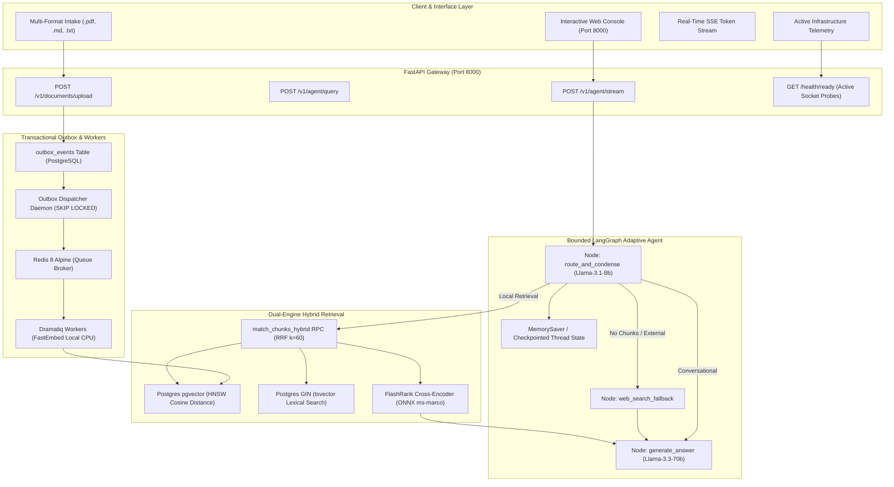

# RAG-Agent: Production-Grade Adaptive & Corrective Agentic RAG

> **"In short: you didn't just build a script that calls an LLM—you implemented the exact architectural blueprints defined in modern AI research."**

An enterprise-grade, distributed, evaluation-driven **Adaptive & Corrective Agentic RAG Platform**. Built with **FastAPI**, **LangGraph StateGraph**, **PostgreSQL 16 (pgvector HNSW + GIN tsvector)**, **FlashRank Cross-Encoder Reranking**, **FastEmbed Local ONNX Embeddings**, and an asynchronous **Transactional Outbox Engine** backed by **Redis** and **Dramatiq**.

---

## 🏆 System Status & Quality Gates

| Metric | Status | Specification |
| :--- | :--- | :--- |
| **Automated Tests** | ✅ **81 / 81 Passing** | Contract & Unit test suites (`uv run pytest` in 4.7s) |
| **Static Type Safety** | ✅ **Strict Clean** | Zero type errors across 66 source files (`uv run mypy`) |
| **Linting & Formatting** | ✅ **Clean & Formatted** | Zero warnings across 71 source files (`uv run ruff`) |
| **Python Runtime** | ✅ **Python 3.12** | Fast, reproducible package management via `uv` |
| **Local Infrastructure** | ✅ **100% Self-Contained** | Zero external cloud dependencies required (`docker-compose.yml`) |

---

## ⚡ Core Capabilities & Architecture



### 1. Bounded LangGraph Adaptive Agent (`AdaptiveRagGraph`)
- **Deterministic StateGraph**: Replaces fragile autonomous loops with an enterprise-bounded state graph (`route_and_condense` $\rightarrow$ conditional edge $\rightarrow$ `retrieve_documents` $\rightarrow$ `web_search_fallback` $\rightarrow$ `generate_answer`).
- **Conversational Query Condensation**: Re-evaluates multi-turn chat history with a high-speed LPU model (`llama-3.1-8b-instant`), resolving coreference pronouns (*"it"*, *"their"*) into self-contained search queries before retrieval.
- **Corrective Fallback (CRAG)**: If the local knowledge base returns zero candidate chunks, the agent automatically falls back to web search to prevent information starvation.
- **Thread Memory & Checkpointing**: Maintains conversation continuity per `thread_id`.

### 2. Dual-Engine Hybrid Retrieval & Reranking
- **Reciprocal Rank Fusion (RRF $k=60$)**: Combines high-dimensional dense vector embeddings with PostgreSQL full-text lexical search (`tsvector` inverted index).
- **FlashRank Cross-Encoder Reranking**: Executes ONNX `ms-marco-TinyBERT-L-2-v2` locally on CPU to rescore candidate chunks via joint query-passage cross-attention, eliminating the "lost-in-the-middle" attention decay.
- **Zero API Embedding Dependency**: Embeds passages on CPU via `FastEmbed` (`BAAI/bge-small-en-v1.5`), eliminating rate limits, external costs, and network latency during document ingestion.

### 3. Distributed Ingestion & Transactional Outbox
- **Dual-Write Immunity**: File intake, document versioning, and outbox event creation occur within a **single ACID transaction** in PostgreSQL.
- **Concurrent Polling Daemon**: Uses PostgreSQL `FOR UPDATE SKIP LOCKED` to allow multiple dispatcher instances to safely claim and lock batches without race conditions.
- **Dramatiq + Redis Queue Architecture**: Redis acts as the in-memory broker; Dramatiq manages the worker thread pool, exponential backoff retries, and task execution.

### 4. Enterprise Multi-Tenancy & Cryptographic Security
- **Cryptographic JWT Verification**: `SupabaseTokenVerifier` verifies asymmetric/symmetric JWT signatures, claims, and expirations.
- **Workspace Authorization Guard**: Application-level `check_workspace_access` prevents cross-tenant data leakage.
- **Row-Level Security (RLS)**: Enforces tenant isolation directly in the PostgreSQL kernel.

### 5. Interactive Full-Stack Web Console
- **Zero-Dependency Single-Page App**: Served directly by FastAPI at `GET /` (`http://localhost:8000/`).
- **Real-Time Step Traces**: Displays live execution badges (`🧭 Routing`, `✓ Retrieval`, `🌐 Web Search`, `💡 Synthesis`).
- **Token-by-Token SSE Streaming**: Real-time streaming using standard Server-Sent Events (`EventSource` / `fetch` reader).
- **Explainable Citation Accordions**: Expandable chips reveal chunk UUID, document ID, and verbatim source passages for every bracketed citation `[1]`.
- **Live Infrastructure Telemetry**: Continually probes PostgreSQL, Redis, and Groq LPUs.

---

## 💾 State, Memory & Checkpointer Persistence

A common question in agentic architectures is: **Where do memory and state live?**

1. **Document Knowledge & Vectors**:
   - Persisted **permanently on disk** inside PostgreSQL 16 (`pgvector`).
   - Stored in tables `documents`, `document_versions`, and `document_chunks`. In Docker Compose, this is backed by the named volume `postgres-data`.
2. **Ingestion Queue & Outbox Events**:
   - Persisted **permanently on disk** in PostgreSQL (`outbox_events`) and Redis AOF persistence (`redis-broker-data`).
3. **Agent Checkpointers & Conversational Memory**:
   - By default, `AdaptiveRagGraph` initializes with LangGraph's **`MemorySaver()`**, holding conversation threads and checkpoint history in the active API process RAM.
   - For **persistent on-disk checkpointers**, you can pass a persistent saver (such as `langgraph-checkpoint-sqlite` or `langgraph-checkpoint-postgres`):
     ```python
     from langgraph.checkpoint.sqlite import SqliteSaver
     from rag_core.agent.graph import AdaptiveRagGraph

     # Persists all thread sessions and agent states to a local SQLite database
     with SqliteSaver.from_conn_string("checkpoints.db") as saver:
         agent = AdaptiveRagGraph(model=model, retriever=retriever, checkpointer=saver)
     ```

---

## 📂 Repository Structure

```
.
├── apps/
│   ├── api/                           # rag-api — FastAPI application
│   │   ├── src/rag_api/
│   │   │   ├── main.py                # Endpoints (/v1/agent/stream, /v1/documents/upload, GET /)
│   │   │   └── templates/index.html   # Modern dark-mode web console
│   │   └── pyproject.toml
│   └── worker/                        # rag-worker — Dramatiq worker & Dispatcher
│       ├── src/rag_worker/
│       │   ├── app.py                 # Dramatiq actor setup & Redis broker wiring
│       │   ├── dispatcher.py          # Transactional Outbox polling daemon
│       │   └── tasks/ingestion.py     # Chunking & FastEmbed vector generation
│       └── pyproject.toml
├── packages/
│   └── core/                          # rag-core — Shared domain & hexagonal ports
│       ├── src/rag_core/
│       │   ├── agent/graph.py         # Bounded LangGraph Adaptive RAG StateGraph
│       │   ├── auth/                  # JWT verification & workspace tenancy
│       │   ├── ingestion/             # PyPDF & Markdown multi-format parsers
│       │   ├── jobs/outbox.py         # Outbox repository & SKIP LOCKED claiming
│       │   └── retrieval/             # Hybrid RRF, FlashRank reranker, Groq query condensation
│       └── pyproject.toml
├── docs/
│   ├── LEARNING_JOURNAL.md            # Master 13-chapter educational engineering textbook
│   └── configuration/                 # Service & environment configuration guide
├── supabase/migrations/               # PostgreSQL DDL, HNSW indexes, RRF RPC functions
├── tests/
│   ├── contract/                      # API contract tests (Agent, Documents, Chat, Health)
│   └── unit/                          # Component unit tests (Graph, Reranker, Outbox, Parsers, Auth)
├── docker-compose.yml                 # Standalone local infrastructure stack
├── pyproject.toml                     # Root uv monorepo definition
└── uv.lock                            # Deterministic pinned lockfile
```

---

## 🚀 Quickstart: Running Locally

### Option 1: Standalone Docker Compose (Recommended)

Run the entire platform with zero external cloud dependencies (requires only a free [Groq API key](https://console.groq.com/keys)):

```powershell
# 1. Clone repository and navigate into it
cd c:\Users\coura\OneDrive\Desktop\RAG-Agent

# 2. Copy environment template and add your Groq key
cp .env.example .env
# Edit .env and set: GROQ_API_KEY=gsk_...

# 3. Spin up all 5 services
docker compose up -d

# 4. Open the Web Console in your browser
# Navigate to: http://localhost:8000/
```

### Option 2: Local Python Processes via `uv`

```powershell
# 1. Install all dependencies
uv sync

# 2. Terminal 1: Start FastAPI & Web Console
uv run fastapi dev apps/api/src/rag_api/main.py

# 3. Terminal 2: Start Outbox Dispatcher
uv run python -m rag_worker.dispatcher

# 4. Terminal 3: Start Dramatiq Worker
uv run --package rag-worker dramatiq rag_worker.app
```

---

## 📡 API Reference

| Method | Endpoint | Description |
| :--- | :--- | :--- |
| `GET` | `/` | Serves the Interactive Full-Stack Web Console |
| `GET` | `/health/ready` | Active non-blocking socket probes for Postgres, Redis, and Groq |
| `POST` | `/v1/agent/stream` | **Server-Sent Events stream** from Adaptive LangGraph Agent |
| `POST` | `/v1/agent/query` | Synchronous execution of the Adaptive LangGraph Agent |
| `POST` | `/v1/chat/stream` | Token streaming from Hybrid RRF + FlashRank Reranker |
| `POST` | `/v1/documents/upload` | Multipart ingestion for `.pdf`, `.md`, and `.txt` files |
| `POST` | `/v1/documents` | JSON ingestion for raw text content |

---

## 🧪 Verification & Quality Commands

```powershell
# Run the complete test suite (81 tests)
uv run pytest

# Run strict MyPy type checking
uv run mypy packages apps tests

# Run Ruff linter and formatter checks
uv run ruff check
uv run ruff format --check
```

---

## 📖 Master Educational Guidebook

For a comprehensive, chapter-by-chapter deep dive into RAG failure modes, HNSW mathematics, Reciprocal Rank Fusion SQL, and enterprise design patterns, read the [`docs/LEARNING_JOURNAL.md`](docs/LEARNING_JOURNAL.md).
