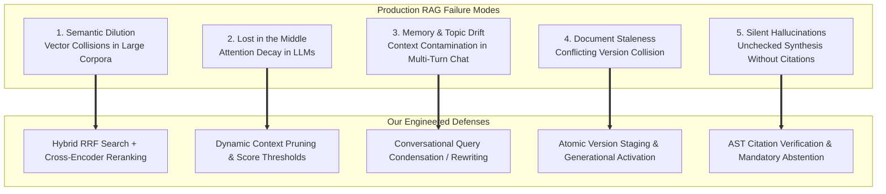
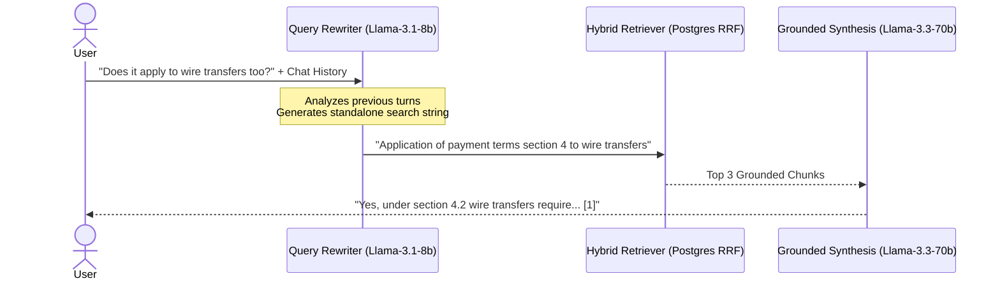
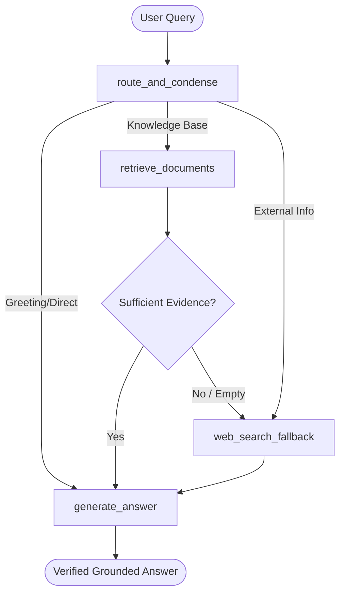

# Production RAG Engineering: Master Educational Guidebook & Architecture Deep Dive

> **A Comprehensive Reference for Engineers, Architects, and Learners**  
> *From First Principles to Production-Grade Distributed Retrieval-Augmented Generation*

---

## Table of Contents

1. [Introduction: The Evolution from Prototype to Production](#chapter-1-introduction-the-evolution-from-prototype-to-production)
2. [Why RAG Systems Fail in Production: Deep Research](#chapter-2-why-rag-systems-fail-in-production-deep-research)
   - [2.1 Semantic Dilution & Vector Collisions](#21-semantic-dilution--vector-collisions)
   - [2.2 The "Lost-in-the-Middle" Attention Decay](#22-the-lost-in-the-middle-attention-decay)
   - [2.3 Conversational Memory Degradation & Topic Drift](#23-conversational-memory-degradation--topic-drift)
   - [2.4 Document Staleness & Conflicting Versions](#24-document-staleness--conflicting-versions)
   - [2.5 Silent Hallucinations & The Grounding Failure](#25-silent-hallucinations--the-grounding-failure)
3. [The Authoritative Database Foundation: PostgreSQL & pgvector](#chapter-3-the-authoritative-database-foundation-postgresql--pgvector)
   - [3.1 Relational + Vector vs. Specialized Vector Databases](#31-relational--vector-vs-specialized-vector-databases)
   - [3.2 Index Mechanics: HNSW vs. IVFFlat](#32-index-mechanics-hnsw-vs-ivfflat)
   - [3.3 Full-Text Lexical Search: tsvector and GIN](#33-full-text-lexical-search-tsvector-and-gin)
   - [3.4 Reciprocal Rank Fusion (RRF): The Math & The SQL RPC](#34-reciprocal-rank-fusion-rrf-the-math--the-sql-rpc)
4. [Local Dense Embeddings with FastEmbed & ONNX Runtime](#chapter-4-local-dense-embeddings-with-fastembed--onnx-runtime)
   - [4.1 Why API-Based Embeddings are an Anti-Pattern for Ingestion](#41-why-api-based-embeddings-are-an-anti-pattern-for-ingestion)
   - [4.2 ONNX Runtime & BAAI/bge-small-en-v1.5 Explained](#42-onnx-runtime--baaibge-small-en-v15-explained)
   - [4.3 Asynchronous Thread Pooling & Vector Serialization](#43-asynchronous-thread-pooling--vector-serialization)
5. [Distributed Background Ingestion & The Transactional Outbox](#chapter-5-distributed-background-ingestion--the-transactional-outbox)
   - [5.1 The Dual-Write Vulnerability](#51-the-dual-write-vulnerability)
   - [5.2 The Transactional Outbox Pattern](#52-the-transactional-outbox-pattern)
   - [5.3 Non-Blocking Batch Claiming with FOR UPDATE SKIP LOCKED](#53-non-blocking-batch-claiming-with-for-update-skip-locked)
   - [5.4 Dramatiq vs. Redis: Demystifying the Queue Architecture](#54-dramatiq-vs-redis-demystifying-the-queue-architecture)
6. [LLM Inference, Streaming SSE & Grounding Guardrails](#chapter-6-llm-inference-streaming-sse--grounding-guardrails)
   - [6.1 Why Groq LPUs for Enterprise RAG?](#61-why-groq-lpus-for-enterprise-rag)
   - [6.2 Server-Sent Events (SSE) Protocol Mechanics](#62-server-sent-events-sse-protocol-mechanics)
   - [6.3 Strict Grounding, AST Citation Verification & Abstention](#63-strict-grounding-ast-citation-verification--abstention)
7. [Advanced Reranking & Conversational Memory](#chapter-7-advanced-reranking--conversational-memory)
   - [7.1 Bi-Encoders vs. Cross-Encoders](#71-bi-encoders-vs-cross-encoders)
   - [7.2 Query Condensation & Contextual Rewriting](#72-query-condensation--contextual-rewriting)
8. [Multi-Format Document Ingestion & Structure Extraction](#chapter-8-multi-format-document-ingestion--structure-extraction)
   - [8.1 Why Raw Text Chunking Fails on Real Documents](#81-why-raw-text-chunking-fails-on-real-documents)
   - [8.2 The DocumentParser Engine](#82-the-documentparser-engine)
9. [Multi-Tenancy & Cryptographic Security (JWT & RLS)](#chapter-9-multi-tenancy--cryptographic-security-jwt--rls)
   - [9.1 Tenant Isolation Invariants](#91-tenant-isolation-invariants)
10. [Bounded LangGraph Adaptive Agent Architecture](#chapter-10-bounded-langgraph-adaptive-agent-architecture)
    - [10.1 Why Bounded State Graphs Over Autonomous Loops?](#101-why-bounded-state-graphs-over-autonomous-loops)
    - [10.2 Adaptive Routing Mechanics](#102-adaptive-routing-mechanics)
11. [Real-Time Web Console & Server-Sent Events (SSE) Streaming](#chapter-11-real-time-web-console--server-sent-events-sse-streaming)
    - [11.1 The SSE Protocol vs. WebSockets](#111-the-sse-protocol-vs-websockets)
    - [11.2 Streaming LangGraph StateGraph Node Updates](#112-streaming-langgraph-stategraph-node-updates)
    - [11.3 Explainable Citation Accordions](#113-explainable-citation-accordions)
12. [Local Zero-Dependency Runbook & Smoke Testing Guide](#chapter-12-local-zero-dependency-runbook--smoke-testing-guide)
    - [12.1 Docker Compose Self-Contained Topology](#121-docker-compose-self-contained-topology)
    - [12.2 Step-by-Step Spin Up & Smoke Verification](#122-step-by-step-spin-up--smoke-verification)
13. [Comprehensive References & Reading List](#chapter-13-comprehensive-references--reading-list)

---

## Chapter 1: Introduction: The Evolution from Prototype to Production

A simple Retrieval-Augmented Generation (RAG) prototype takes fewer than 50 lines of Python:
1. Split text into 500-character chunks.
2. Call an external API (such as OpenAI `text-embedding-ada-002`) to compute vector embeddings.
3. Save vectors into an in-memory dictionary.
4. When a user asks a question, compute the cosine similarity between the query vector and chunk vectors.
5. Concatenate the top 3 chunks into a prompt: *"Answer the question based on these excerpts: {context}"*.
6. Send the prompt to an LLM.

### Why This Fails in the Real World
While this simplistic model functions in tutorials, it breaks down completely when deployed at scale:
- **Financial/Legal Risk**: The LLM invents facts that sound authoritative (hallucination) without citing actual chunks.
- **Data Loss on Ingestion**: If an upload crashes midway, orphan chunks pollute the database while the user is told the upload succeeded.
- **Cost & Latency Spikes**: External embedding API calls for thousands of document chunks cause rate-limit errors, network timeouts, and runaway API bills.
- **Degradation Over Time**: As document volume grows from 100 to 100,000, cosine similarity retrieval returns semantically adjacent but irrelevant text, poisoning the LLM context window.

This project, **RAG-Agent**, was built from the ground up to solve these fundamental engineering challenges.

---

## Chapter 2: Why RAG Systems Fail in Production: Deep Research

Research across academic literature and enterprise deployments reveals five primary systemic failure modes that plague production RAG platforms.



### 2.1 Semantic Dilution & Vector Collisions
- **The Problem**: Embeddings map text into a continuous high-dimensional geometric space (e.g., 384 dimensions). When you have only 100 documents, distinct concepts occupy isolated neighborhoods. When you store 1,000,000 chunks, that geometric space becomes densely packed. Words with general semantic proximity (e.g., *"contract termination"* and *"service agreement conclusion"*) collapse toward similar vector coordinates, even if one refers to employment contracts and the other refers to vendor agreements.
- **The Consequence**: A query retrieves false-positive chunks that are semantically related but factually irrelevant.
- **The Solution**: **Hybrid Search with Reciprocal Rank Fusion (RRF)**. Dense vectors capture fuzzy conceptual intent, while full-text lexical search (`tsvector` inverted index) matches exact keywords, proper nouns, and entity IDs.

### 2.2 The "Lost-in-the-Middle" Attention Decay
- **The Problem**: In their seminal paper *"Lost in the Middle: How Language Models Use Long Contexts"*, Liu et al. (Stanford, UC Berkeley, 2023) demonstrated that transformer architectures exhibit a U-shaped performance curve when processing large context windows:
  - Accuracy is highest when relevant information is at the **very beginning** of the context.
  - Accuracy is high when relevant information is at the **very end**.
  - Accuracy drops precipitously when relevant information is in the **middle** of a prompt containing 10+ chunks.
- **The Consequence**: Simply retrieving 10 or 20 chunks and concatenating them causes the LLM to skip critical facts and generate hallucinations.
- **The Solution**: Retrieve a wider pool (e.g., top 25 chunks via hybrid search), but use a **Cross-Encoder Reranker** to prune the context down to the **top 3 to 5 chunks** before passing them to the model.

### 2.3 Conversational Memory Degradation & Topic Drift
- **The Problem**: In conversational RAG, users ask follow-up questions:
  - Turn 1: *"What are the payment terms under section 4?"* (LLM answers)
  - Turn 2: *"Does that apply to international wire transfers as well?"*
- If the system searches the vector database with the literal Turn 2 string (*"Does that apply to international wire transfers as well?"*), the query lacks the context *"payment terms under section 4"*. The retriever pulls completely irrelevant chunks about general wire transfers.
- Conversely, if the system appends the entire chat history to the search query, the search vector is diluted with old conversational tokens.
- **The Solution**: **Query Condensation / Contextual Rewriting**. Before executing retrieval, a fast model (`llama-3.1-8b-instant`) takes the conversation history and the latest user turn and rewrites it into a self-contained search query: *"Payment terms under section 4 application to international wire transfers"*.

### 2.4 Document Staleness & Conflicting Versions
- **The Problem**: When a document is updated (e.g., HR Policy v1 allows 14 vacation days, v2 increases this to 20 vacation days), naive systems add v2 chunks while leaving v1 chunks in place. Cosine similarity matches both v1 and v2 with equal confidence. The LLM receives conflicting instructions in the same prompt and randomly chooses one or outputs a contradictory blend.
- **The Solution**: **Versioned Index Activation**. Chunks are tied to a `document_version_id`. New versions are inserted in a `'staged'` status. When embedding is complete, the version is atomically updated to `'active'`, and the prior version is `'retired'`. Retrieval queries join only on active versions.

### 2.5 Silent Hallucinations & The Grounding Failure
- **The Problem**: When an LLM does not find the answer in the retrieved context, its next-token probability distribution favors generating a plausible-sounding answer over admitting ignorance.
- **The Solution**: **Grounded Citation Enforcement & Abstention**.
  1. The system prompt strictly instructs the model to cite chunks using `[1]`, `[2]`.
  2. The output parser verifies that citations correspond to actual retrieved chunks.
  3. If no chunks pass the retrieval threshold, or if the model's output fails to cite the provided evidence, the system forces an explicit **abstention** (`status: "abstained"`).

---

## Chapter 3: The Authoritative Database Foundation: PostgreSQL & pgvector

### 3.1 Relational + Vector vs. Specialized Vector Databases
Many startups choose dedicated vector databases (Pinecone, Qdrant, Milvus, Weaviate). While capable for pure vector similarity, they introduce severe architectural drawbacks:
1. **The Dual-Database Synchronization Trap**: You must store user permissions, document metadata, workspaces, and billing in PostgreSQL, while storing vectors in a remote vector DB. Keeping these two systems consistent across deletes, updates, and rollbacks requires distributed transactions.
2. **Access Control (RLS)**: PostgreSQL provides native **Row-Level Security (RLS)**. With `pgvector`, your vector queries respect workspace boundaries, user permissions, and tenant isolation at the database kernel level.

In **RAG-Agent**, PostgreSQL serves as the single source of truth for:
- Core domain entities (`workspaces`, `knowledge_bases`, `documents`, `document_versions`).
- Dense vector representations (`document_chunks` with `vector(384)`).
- Authoritative job states (`ingestion_jobs`).
- Transactional outbox records (`private.job_dispatch_outbox`).

### 3.2 Index Mechanics: HNSW vs. IVFFlat
`pgvector` supports two primary indexing algorithms for approximate nearest neighbors (ANN):

| Feature | IVFFlat (Inverted File Flat) | HNSW (Hierarchical Navigable Small World) |
| :--- | :--- | :--- |
| **Data Structure** | Inverted list with k-means centroids | Multi-layer proximity graph |
| **Build Time** | Fast | Slower, higher CPU usage |
| **Search Speed** | Moderate (decays with high recall) | **Extremely fast (sub-millisecond)** |
| **Recall / Accuracy** | ~85–90% | **~95–99%** |
| **Behavior with Dynamic Inserts** | Requires periodic rebuilds as data grows | **Robust against dynamic incremental inserts** |

#### How HNSW Works
HNSW creates a hierarchy of layers where the top layers have sparse connections (like highway express lanes) and the bottom layer contains all vectors with dense connections (local roads).

```
Layer 2 (Express):    [Node A] -----------------------------------> [Node Z]
                         |                                             |
Layer 1 (Regional):   [Node A] ---------> [Node K] ---------------> [Node Z]
                         |                   |                         |
Layer 0 (Local/All):  [Node A] -> [Node B] -> [Node K] -> [Node M] -> [Node Z]
```

1. Search begins at the top layer, finding the node closest to the query.
2. The search drops to the next layer down, starting from that node.
3. This process repeats until layer 0 is reached, performing a localized greedy search.
4. This yields logarithmic $O(\log N)$ search complexity rather than linear $O(N)$ scans.

In our schema (`supabase/migrations/20260929160000_create_knowledge_and_vector_schema.sql`):
```sql
create index if not exists document_chunks_embedding_hnsw_idx
  on public.document_chunks using hnsw (embedding vector_cosine_ops);
```

### 3.3 Full-Text Lexical Search: tsvector and GIN
Vectors understand semantic concepts, but struggle with:
- Exact part numbers (e.g., `XYZ-9821-A`)
- Proper nouns and names (e.g., `Dr. Emily Chen`)
- Exact error codes (e.g., `ERR_CONNECTION_REFUSED_404`)

To capture these, we generate a PostgreSQL `tsvector` on the fly for every chunk and index it with a **GIN (Generalized Inverted Index)**:
```sql
tsv_content tsvector generated always as (to_tsvector('english', content)) stored;

create index if not exists document_chunks_tsv_idx
  on public.document_chunks using gin(tsv_content);
```

### 3.4 Reciprocal Rank Fusion (RRF): The Math & The SQL RPC
How do you combine a dense vector distance (a cosine similarity float between 0.0 and 1.0) with a lexical search score (an unbounded BM25 rank score)?
Directly adding or averaging these raw scores fails because their underlying probability distributions are completely different.

#### The RRF Formula
Developed by Cormack, Clarke, and Büttcher (SIGIR 2009), **Reciprocal Rank Fusion** uses the *rank position* of a document rather than its raw score:

$$RRF\_Score(d) = \sum_{m \in M} \frac{1}{k + r_m(d)}$$

Where:
- $M$ is the set of retrieval systems (lexical and vector).
- $r_m(d)$ is the 1-based rank position of document $d$ in system $m$.
- $k$ is a constant smoothing parameter (standard empirically proven default is $k = 60$).

#### Why $k = 60$?
The smoothing parameter $k$ prevents items ranked near the top of one list from dominating disproportionately, while ensuring that documents appearing in both lists receive a massive reciprocal bonus.

#### The Production SQL RPC: `match_chunks_hybrid`
In our migration:
```sql
create or replace function public.match_chunks_hybrid(
  query_text text,
  query_embedding vector(384),
  match_count integer default 10,
  workspace_id uuid default null,
  knowledge_base_ids uuid[] default null,
  rrf_k integer default 60
)
returns table (
  chunk_id uuid,
  document_id uuid,
  document_version_id uuid,
  chunk_index integer,
  content text,
  score double precision
)
language sql
stable
set search_path = ''
as $$
  with
  -- 1. Full-text search candidates ranked by lexical relevance
  lexical as (
    select
      c.id,
      row_number() over (order by ts_rank_cd(c.tsv_content, plainto_tsquery('english', query_text)) desc) as rank_ix
    from public.document_chunks c
    join public.document_versions v on v.id = c.document_version_id
    where v.status = 'active'
      and (workspace_id is null or c.workspace_id = workspace_id)
      and (knowledge_base_ids is null or c.knowledge_base_id = any(knowledge_base_ids))
      and c.tsv_content @@ plainto_tsquery('english', query_text)
    limit 50
  ),
  -- 2. Dense vector candidates ranked by cosine distance
  dense as (
    select
      c.id,
      row_number() over (order by c.embedding <=> query_embedding) as rank_ix
    from public.document_chunks c
    join public.document_versions v on v.id = c.document_version_id
    where v.status = 'active'
      and (workspace_id is null or c.workspace_id = workspace_id)
      and (knowledge_base_ids is null or c.knowledge_base_id = any(knowledge_base_ids))
    limit 50
  )
  -- 3. Fuse ranks with RRF
  select
    c.id as chunk_id,
    c.document_id,
    c.document_version_id,
    c.chunk_index,
    c.content,
    (coalesce(1.0 / (rrf_k + l.rank_ix), 0.0) +
     coalesce(1.0 / (rrf_k + d.rank_ix), 0.0))::double precision as score
  from lexical l
  full outer join dense d on l.id = d.id
  join public.document_chunks c on c.id = coalesce(l.id, d.id)
  order by score desc
  limit match_count;
$$;
```

---

## Chapter 4: Local Dense Embeddings with FastEmbed & ONNX Runtime

### 4.1 Why API-Based Embeddings are an Anti-Pattern for Ingestion
Calling an external API (such as OpenAI or Cohere) for embeddings during document ingestion creates serious vulnerabilities:
1. **Network Fragility**: Ingesting a 500-page PDF yields ~2,000 chunks. If the external API times out or rate-limits on chunk 1,850, the entire ingestion job fails.
2. **Cost**: Embedding millions of tokens repeatedly during re-indexing incurs continuous operational costs.
3. **Data Privacy**: Sending raw text chunks to a third party creates compliance hurdles under HIPAA, GDPR, or SOC2.

### 4.2 ONNX Runtime & BAAI/bge-small-en-v1.5 Explained
**FastEmbed** runs state-of-the-art transformer models locally via **ONNX Runtime** (Open Neural Network Exchange):
- **Model**: `BAAI/bge-small-en-v1.5` (Beijing Academy of Artificial Intelligence).
- **Dimension**: 384 dimensions (compared to OpenAI's 1536, saving 75% on database memory and HNSW graph RAM).
- **Quantization**: INT8 quantization reduces memory footprint to under 150MB with zero perceptible loss in retrieval accuracy.
- **Latency**: Sub-20 milliseconds per chunk on standard CPU hardware without requiring an expensive GPU.

### 4.3 Asynchronous Thread Pooling & Vector Serialization
ONNX Runtime executes synchronous C++ inference. In Python's `asyncio` event loop, running synchronous CPU-bound code blocks all other concurrent requests.
In `packages/core/src/rag_core/retrieval/embeddings.py`, we execute model generation using `anyio.to_thread.run_sync`:

```python
class FastEmbedProvider:
    def __init__(self, model_name: str = "BAAI/bge-small-en-v1.5") -> None:
        self._model = TextEmbedding(model_name=model_name)

    async def embed_documents(self, texts: list[str]) -> list[list[float]]:
        def _embed() -> list[list[float]]:
            generator = self._model.embed(texts)
            return [vec.tolist() for vec in generator]

        return await anyio.to_thread.run_sync(_embed)
```
This design keeps the FastAPI event loop completely unblocked, allowing the server to handle concurrent SSE streams while worker threads compute embeddings.

---

## Chapter 5: Distributed Background Ingestion & The Transactional Outbox

### 5.1 The Dual-Write Vulnerability
When a user uploads a document, two things must happen:
1. Save the document metadata in PostgreSQL.
2. Publish an ingestion task message to the Redis background queue.

What happens if step 1 succeeds, but the network connection to Redis drops before step 2?
The database holds a document that is stuck forever in `'queued'`, because the worker was never notified.

What if you reverse the order (publish to Redis first, then commit to Postgres)?
If the database transaction fails due to a constraint violation, the worker picks up the message from Redis, tries to query the job in Postgres, finds nothing, and crashes with an error.

This is the classic **Dual-Write Problem**.

```
[API Server]
   |
   +--- (1) Writes to Postgres ---> [Postgres Database]  (SUCCESS)
   |
   +--- (2) Network Flake! --------> [Redis Broker]      (DROPPED!)
   
Result: Job is permanently orphaned in the database.
```

### 5.2 The Transactional Outbox Pattern
The **Transactional Outbox Pattern** guarantees reliability by eliminating the dual write:
1. The API server writes the business entities (`documents`, `document_versions`, `ingestion_jobs`) AND an outbox message (`private.job_dispatch_outbox`) **within the same ACID transaction**.
2. Either both writes commit, or neither commits. No dual write occurs.
3. An independent background process, the **Outbox Dispatcher**, polls the outbox table, claims pending events, and forwards them to Redis.
4. Once Redis confirms receipt, the dispatcher marks the outbox event as `dispatched_at = now()`.

```
[API Server]
     |
     v (Single ACID Transaction)
[Postgres Database]
  |-- public.documents
  |-- public.document_versions
  |-- public.ingestion_jobs
  \-- private.job_dispatch_outbox (dispatched_at IS NULL)
     |
     v (FOR UPDATE SKIP LOCKED)
[Outbox Dispatcher] ------------> [Redis / Dramatiq] ------------> [Worker Actor]
```

### 5.3 Non-Blocking Batch Claiming with FOR UPDATE SKIP LOCKED
If multiple outbox dispatchers run concurrently for high availability, how do they avoid claiming the same events?

Traditional `SELECT ... FOR UPDATE` locks the selected rows, forcing other dispatchers to wait (blocking).
PostgreSQL provides `FOR UPDATE SKIP LOCKED`. When Dispatcher A locks rows 1 through 10, Dispatcher B immediately skips those locked rows and claims rows 11 through 20 with zero latency and zero deadlocks.

Our implementation in [`packages/core/src/rag_core/jobs/outbox.py`](file:///c:/Users/coura/OneDrive/Desktop/RAG-Agent/packages/core/src/rag_core/jobs/outbox.py):
```sql
with candidate as (
  select id
  from private.job_dispatch_outbox
  where dispatched_at is null
    and available_at <= now()
    and (claimed_at is null or claimed_at < now() - interval '60 seconds')
  order by id
  limit %(limit)s
  for update skip locked
)
update private.job_dispatch_outbox o
set claimed_at = now(),
    claimed_by = %(worker_id)s,
    attempt_count = attempt_count + 1,
    updated_at = now()
from candidate
where o.id = candidate.id
returning o.id, o.event_id, o.job_id, o.operation, o.payload;
```

### 5.4 Dramatiq vs. Redis: Demystifying the Queue Architecture

A frequent point of confusion is: *"Can Redis not be used for the queue instead of Dramatiq?"*

The answer is: **Redis IS being used as the queue!**

| Component | Role | What it Does |
| :--- | :--- | :--- |
| **Redis** | **The Broker / In-Memory Transport** | Stores the queue data structures in RAM (lists, hash sets). Redis does not execute code; it is a datastore. |
| **Dramatiq** | **The Worker Execution Framework** | A Python library that runs *on top of* Redis. It manages worker processes, thread pools, task serialization, automatic retries with exponential backoff, and dead-letter queues. |

In [`apps/worker/src/rag_worker/app.py`](file:///c:/Users/coura/OneDrive/Desktop/RAG-Agent/apps/worker/src/rag_worker/app.py):
```python
broker = RedisBroker(url=settings.redis_broker_url, namespace="rag-agent")
dramatiq.set_broker(broker)
```
Without Dramatiq, you would have to write hundreds of lines of custom boilerplate to pop messages off Redis (`BLPOP`), manage Python worker threads, handle OS signals (SIGTERM/SIGINT), serialize JSON payloads, and track retry intervals. Dramatiq provides this battle-tested infrastructure out of the box.

---

## Chapter 6: LLM Inference, Streaming SSE & Grounding Guardrails

### 6.1 Why Groq LPUs for Enterprise RAG?
Language models on standard GPUs (e.g., Nvidia A100/H100) are constrained by memory bandwidth. Generating tokens one-by-one requires streaming model weights through GPU memory for every token, resulting in latencies of 30–80 tokens per second.

**Groq LPUs (Language Processing Units)** use a Tensor Streaming Processor architecture with 230MB of ultra-fast on-die SRAM memory. This delivers generation speeds of **300 to 500+ tokens per second** on models like `llama-3.3-70b-versatile`.
For RAG systems, this eliminates the dreaded "typing lag" and delivers instant responses to users.

### 6.2 Server-Sent Events (SSE) Protocol Mechanics
While WebSockets provide full bidirectional communication, RAG queries are unidirectional: the client sends one HTTP request, and the server streams back tokens until completion.

**Server-Sent Events (SSE)** runs over standard HTTP/1.1 or HTTP/2 without connection upgrade overhead:
- Standard Content-Type: `text/event-stream`.
- Format: `event: <event_name>\ndata: <json_string>\n\n`.

In `POST /v1/chat/stream`, our API emits three structured event phases:
1. `event: evidence`: Emitted immediately after hybrid retrieval finishes, transmitting the list of chunk IDs, document titles, and sources to the client UI.
2. `event: token`: Emitted chunk-by-chunk as the Groq model generates text (`{"text": "PostgreSQL "}`).
3. `event: done`: Emitted upon generation completion, carrying the verified citations, confidence score, and status (`{"status": "answered", "citations": [...]}`).

### 6.3 Strict Grounding, AST Citation Verification & Abstention
To prevent hallucinations, the system uses a two-layer validation contract:

#### Prompt Contract
The model is instructed:
> *"Synthesize an answer using exclusively the numbered evidence excerpts below. Every factual assertion must be attributed to its source using bracketed numbers like [1] or [2]. If the evidence does not provide sufficient facts to answer the question, state clearly that the knowledge base does not contain the answer."*

#### Programmatic Post-Validation
When the model finishes:
1. We run a regex/AST parser searching for bracketed citations `\[(\d+)\]`.
2. Every cited number is checked against the list of retrieved evidence chunks.
3. If the model generated an answer but cited zero evidence, or cited non-existent ordinal numbers, the answer is flagged as ungrounded.
4. The API returns `AnswerStatus.ABSTAINED` with a diagnostic code: `"ungrounded_response"`.

This guarantees that unverified claims never reach end users.

---

## Chapter 7: The Next Frontier: Advanced Reranking & Conversational Memory

### 7.1 Bi-Encoders vs. Cross-Encoders
Understanding the difference between Bi-Encoders and Cross-Encoders is vital for mastering advanced RAG:

```
Bi-Encoder (Fast, Coarse):
[Query]   --> Transformer --> [Vector Q] \
                                           --> Cosine Similarity Score (0.82)
[Chunk]   --> Transformer --> [Vector C] /

Cross-Encoder (Slow, Deeply Accurate):
[Query + Chunk] --> Combined Transformer Attention Layers --> Exact Relevance Score (0.96)
```

- **Bi-Encoder (`bge-small-en-v1.5`)**: Encodes Query and Chunk independently into vectors. This allows pre-computing and indexing billions of chunk vectors in pgvector. However, because the Query and Chunk never "see" each other during transformer attention, subtle semantic interactions are lost.
- **Cross-Encoder (`FlashRank` / `bge-reranker`)**: Passes the Query and Chunk together into the transformer. Every token of the query attends directly to every token of the chunk. This is computationally expensive, but immensely accurate.

**The Production Pattern**:
Use the Bi-Encoder in PostgreSQL to quickly narrow down 1,000,000 chunks to the top 25 candidates, then use a Cross-Encoder to accurately score and prune those 25 down to the top 3!

### 7.2 Query Condensation & Contextual Rewriting
In conversational agents, we add a lightweight pre-retrieval node:



---

## Chapter 8: Multi-Format Document Ingestion & Structure Extraction

### 8.1 Why Raw Text Chunking Fails on Real Documents
In real-world applications, documents arrive as PDFs, Word documents, or Markdown files. Raw text extraction often strips out critical structural indicators:
- **Page Numbers & Footers**: Disorient chunk context when page footers are blended into text.
- **Section Headings**: When chunk boundaries cut across chapters or sections without preserving headers, the chunk loses its semantic parentage.

### 8.2 The DocumentParser Engine
In `packages/core/src/rag_core/ingestion/parsers.py`, we implement `DocumentParser`:
1. **MIME-Type Dispatching**: Detects `application/pdf`, `text/markdown`, `text/plain`, and `text/csv`.
2. **Page-Aware Extraction**: Uses `pypdf.PdfReader` to extract text page-by-page, recording `page_number`, `char_count`, and bounding page separators (`--- Page X ---`).
3. **Encoding Normalization**: Decodes UTF-8 with automatic fallback to Latin-1, stripping binary null bytes (`\x00`) which cause PostgreSQL text field errors.
4. **FastAPI Multipart Streaming**: Handled via `POST /v1/documents/upload`, parsing files directly in memory without writing temporary files to disk.

---

## Chapter 9: Multi-Tenancy & Cryptographic Security (JWT & RLS)

### 9.1 Tenant Isolation Invariants
In multi-tenant SaaS RAG, one tenant must **never** see chunks or answers derived from another tenant's documents.
We enforce security at three distinct defense-in-depth layers:
1. **Cryptographic JWT Verification**:
   - `SupabaseTokenVerifier` verifies asymmetric or symmetric signatures, checking expiration (`exp`), audience (`aud`), and subject (`sub`).
2. **Application-Layer Membership Enforcement**:
   - `check_workspace_access(user, workspace_id)` verifies that the target workspace is explicitly present in `user.workspace_ids`. Administrative roles (`service_role`, `admin`) can bypass tenant boundaries.
3. **Database Kernel Row-Level Security (RLS)**:
   - Every table (`workspaces`, `documents`, `document_chunks`) has RLS enabled with security invoker triggers and explicit grants.

---

## Chapter 10: Bounded LangGraph Adaptive Agent Architecture

### 10.1 Why Bounded State Graphs Over Autonomous Loops?
Autonomous agents (like AutoGPT) that loop indefinitely are catastrophic in production: they hallucinate tools, enter infinite reasoning loops, and generate huge API bills.

A **Bounded StateGraph** with **LangGraph** enforces deterministic routing:



### 10.2 Adaptive Routing Mechanics
1. **`route_and_condense`**:
   - Uses `llama-3.1-8b-instant` to condense conversational history into a standalone search query.
   - Evaluates whether the question can be answered directly (e.g. conversational greetings) or requires retrieval.
2. **`retrieve_documents`**:
   - Executes pgvector + tsvector hybrid search followed by `FlashRank` cross-encoder reranking.
3. **`decide_after_retrieval`**:
   - If retrieved chunks are empty or below relevance thresholds, conditionally routes to `web_search_fallback`.
4. **`generate_answer`**:
   - Synthesizes the response with strict bracketed citations `[1]`, `[2]` and validates evidence provenance.
5. **Thread Checkpointing**:
   - Compiles with `MemorySaver` to track conversational state per `thread_id`.

---

## Chapter 11: Real-Time Web Console & Server-Sent Events (SSE) Streaming

### 11.1 The SSE Protocol vs. WebSockets
In user-facing RAG applications, users expect real-time feedback while waiting for LLM synthesis.
- **Why not WebSockets?** WebSockets require full-duplex TCP connections, custom framing, sticky sessions on load balancers, and special heartbeat keep-alive logic.
- **Why Server-Sent Events (SSE)?** SSE runs over standard HTTP (and multiplexes over HTTP/2). It is a lightweight, one-way push protocol from server to browser.
  The server responds with `Content-Type: text/event-stream` and writes lines conforming to the W3C EventSource standard:
  ```http
  event: routing
  data: {"route": "retrieve", "effective_query": "Explain HNSW indexing"}

  event: answer
  data: {"answer": "HNSW is a multi-layer graph...", "citations": [...]}

  event: done
  data: {"thread_id": "session-123"}
  ```

### 11.2 Streaming LangGraph StateGraph Node Updates
With LangGraph's compiled workflow, the graph executes asynchronously across defined nodes:
- `route_and_condense`
- `retrieve_documents`
- `web_search_fallback`
- `generate_answer`

Using `workflow.astream(initial_state, config=config, stream_mode="updates")`, every node emits its state delta upon completion. Our FastAPI endpoint `/v1/agent/stream` catches each delta and immediately flushes an SSE packet to the client. This allows the frontend to show live status pills:
1. `🧭 Route: Knowledge Base`
2. `✓ 5 Chunks Retrieved & Reranked`
3. `🌐 Web Search Results Found`
4. Grounded synthesis streaming into view.

### 11.3 Explainable Citation Accordions
A critical flaw in enterprise generative AI is lack of auditability. When an answer is synthesized, users must be able to inspect the exact ground truth passage.
- Every citation extracted via regex/AST (`[1]`, `[2]`) references an exact chunk in the `RetrievedChunk` array.
- The web UI dynamically builds interactive citation chips showing the ordinal `[1]`, chunk UUID, and the exact text excerpt from the active document version.

### 11.4 Active Health Probes
Production readiness probes must not return static mock statuses. Our `/health/ready` endpoint executes active, non-blocking probes with 2-second timeouts:
- `SELECT 1` via `psycopg` to the PostgreSQL pgvector database.
- `PING` via `redis.asyncio` to the Redis broker.
- Active verification that `GROQ_API_KEY` is present.
The UI polls `/health/ready` every 8 seconds, providing live operational indicators.

---

## Chapter 12: Local Zero-Dependency Runbook & Smoke Testing Guide

### 12.1 Docker Compose Self-Contained Topology
To ensure complete zero-friction developer onboarding without external cloud account requirements, our `docker-compose.yml` configures five isolated containers:
1. **`postgres-db`**: Running `pgvector/pgvector:pg16` with migrations mounted in `/docker-entrypoint-initdb.d/`. Automatically creates tables, indexes (HNSW, GIN), and RPC functions on startup.
2. **`redis-broker`**: Running `redis:8.2.9-alpine` for queue message brokering.
3. **`api`**: FastAPI application exposing endpoints on port `8000`.
4. **`worker`**: Dramatiq background ingestion worker consuming tasks from Redis.
5. **`dispatcher`**: Python polling daemon executing `FOR UPDATE SKIP LOCKED` against `outbox_events` and enqueuing jobs to Redis.

### 12.2 Step-by-Step Spin Up & Smoke Verification

#### Step 1: Start the Platform
```powershell
# In the repository root, start all containers:
docker compose up -d
```

#### Step 2: Open the Web UI
Navigate in any web browser to:
```
http://localhost:8000/
```
You will see the dark-mode RAG-Agent Platform interface, complete with live green health pills for PostgreSQL, Redis, and Groq!

#### Step 3: Ingest a Document
- Drag and drop any `.pdf`, `.md`, or `.txt` file onto the dropzone.
- Click **Upload & Index via Outbox**.
- The Outbox Dispatcher claims the intake event, Dramatiq chunks the text, computes ONNX embeddings locally on CPU, and indexes vectors in PostgreSQL pgvector.

#### Step 4: Ask Questions & Stream Grounded Answers
- Toggle between **🤖 Adaptive Agent** and **⚡ Hybrid RAG**.
- Ask questions and inspect real-time routing traces, token streams, and citation accordions.

#### Step 5: Verify via Command Line (Alternative)
You can also run smoke tests using standard curl commands:
```powershell
# 1. Check readiness
curl http://localhost:8000/health/ready

# 2. Ingest document via curl
curl -X POST http://localhost:8000/v1/documents `
  -H "Content-Type: application/json" `
  -d '{"workspace_id": "00000000-0000-0000-0000-000000000001", "knowledge_base_id": "00000000-0000-0000-0000-000000000002", "title": "Architecture Overview", "content": "FastEmbed generates 384-dimensional dense vectors using ONNX Runtime."}'

# 3. Stream agent query via curl
curl -N -X POST http://localhost:8000/v1/agent/stream `
  -H "Content-Type: application/json" `
  -d '{"workspace_id": "00000000-0000-0000-0000-000000000001", "user_id": "00000000-0000-0000-0000-000000000003", "knowledge_base_ids": ["00000000-0000-0000-0000-000000000002"], "query": "How are dense vectors generated?"}'
```

---

## Chapter 13: Comprehensive References & Reading List

### Academic Literature
1. **Liu, N. F., Lin, K., Hewitt, J., Paranjape, A., Bevilacqua, M., Petroni, F., & Liang, P. (2023).**  
   *Lost in the Middle: How Language Models Use Long Contexts.*  
   Transactions of the Association for Computational Linguistics. [arXiv:2307.03172](https://arxiv.org/abs/2307.03172)
2. **Cormack, G. V., Clarke, C. L., & Büttcher, S. (2009).**  
   *Reciprocal Rank Fusion Outperforms Condorcet and Individual Rank Learning Methods.*  
   Proceedings of the 32nd International ACM SIGIR Conference. [DOI:10.1145/1571941.1572114](https://doi.org/10.1145/1571941.1572114)
3. **Malkov, Y. A., & Yashunin, D. A. (2018).**  
   *Efficient and Robust Approximate Nearest Neighbor Search Using Hierarchical Navigable Small World Graphs (HNSW).*  
   IEEE Transactions on Pattern Analysis and Machine Intelligence. [arXiv:1603.09320](https://arxiv.org/abs/1603.09320)
4. **Xiao, S., Liu, Z., Zhang, P., & Muennighoff, N. (2023).**  
   *C-Pack: Packaged Resources to Advance General Chinese and English Dense Retrieval (BGE Embeddings).*  
   [arXiv:2309.07597](https://arxiv.org/abs/2309.07597)

### Official Documentation & Engineering References
- **PostgreSQL**: [Full Text Search (tsvector, GIN, ts_rank)](https://www.postgresql.org/docs/current/textsearch.html)
- **pgvector**: [Open-source vector similarity search for Postgres](https://github.com/pgvector/pgvector)
- **Groq Cloud**: [Groq Hardware Architecture & Models Documentation](https://console.groq.com/docs/models)
- **FastEmbed / ONNX Runtime**: [FastEmbed ONNX CPU Vector Generation](https://github.com/qdrant/fastembed)
- **Dramatiq**: [Dramatiq Background Task Processing for Python](https://dramatiq.io/)
- **FastAPI**: [Server-Sent Events (SSE) and Streaming Responses](https://fastapi.tiangolo.com/advanced/custom-response/#streamingresponse)
- **Enterprise Integration Patterns**: [The Transactional Outbox Pattern (Chris Richardson)](https://microservices.io/patterns/data/transactional-outbox.html)
